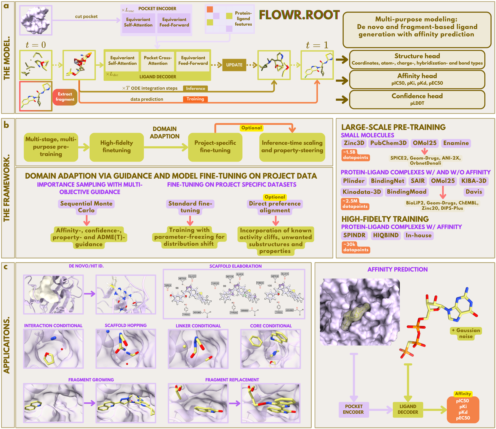

# Flowr.root -- A flow matching based foundation model for joint multi-purpose structure-aware 3D ligand generation and affinity prediction

[](https://arxiv.org/abs/2510.02578)




This is a research repository introducing FLOWR.root. 

**⚠️ PLEASE NOTE:** This is an early release. Final weights with a fully converged model will be shared in a few months.

---

## Table of Contents

- [Installation](#installation)
- [Getting Started](#getting-started)
  - [Data](#data)
  - [Generating Molecules from PDB/CIF](#generating-molecules-from-pdbcif)
  - [Predicting Binding Affinities](#predicting-binding-affinities)
  - [Training](#training)
- [Data Preprocessing](#data-preprocessing)
  - [Input Data Requirements](#input-data-requirements)
  - [Preprocessing Workflow](#preprocessing-workflow)
- [Finetuning](#finetuning)
  - [Prerequisites](#prerequisites)
  - [Running Fine-tuning](#running-fine-tuning)
- [Contributing](#contributing)
- [License](#license)
- [Citation](#citation)

---


## Installation

- **GPU**: CUDA-compatible GPU with at least 40GB VRAM recommended for inference

- **Installation time** Installation takes roughly 5 minutes on a normal computer.

- **Package Manager**: [mamba](https://mamba.readthedocs.io)  
  Install via:
  ```bash
  curl -L -O https://github.com/conda-forge/miniforge/releases/latest/download/Miniforge3-$(uname)-$(uname -m).sh
  bash Miniforge3-$(uname)-$(uname -m).sh
  ```

1. **Create the Environment**  
   Install the required environment using [mamba](https://mamba.readthedocs.io):

   ```bash
   mamba env create -f environment.yml
   ```

2. **Activate the Environment**  

   ```bash
   conda activate flowr_root
   ```

3. **Set PYTHONPATH**  
   Ensure the repository directory is in your Python path:

   ```bash
   export PYTHONPATH="$PWD"
   ```

---

## Getting Started

We provide all datasets in PDB and SDF format, as well as a fully trained FLOWR.root model checkpoint.
For training and generation, we provide basic bash and SLURM scripts in the `scripts/` directory. These scripts are intended to be modified and adjusted according to your computational resources and experimental needs.

### Data
Download the datasets and the FLOWR.root checkpoint here:
[Google Drive](https://drive.google.com/drive/u/0/folders/1NWpzTY-BG_9C4zXZndWlKwdu7UJNCYj8).


### Generating Molecules from PDB/CIF

If you provide a protein PDB/CIF file, you need to provide a ligand file (SDF/MOL/PDB) as well to cut out the pocket (default: 7A cutoff - modify if needed).
We recommend using (Schrödinger-)prepared complexes for best results with the protein and ligand being protonated.

Note, if you want to run conditional generation, you need to provide a ligand file as reference. 
Crucially, there are two different modes, "global" and "local". 
Global: If you want to run scaffold hopping or elaboration (func_group_inpainting, scaffold_inpainting), interaction- (interaction_inpainting) or core-conditional (core_inpainting) generation, simply specifiy it via the respective flags. 
Local: If you want to replace a core, or a fragment of your reference ligand, specify the --substructure_inpainting flag and provide the atom indices with the --substructure flag.

Modify `scripts/generate_pdb.sl` according to your requirements, then submit the job via SLURM:

```bash
sbatch scripts/generate_pdb.sl
```

Generated ligands are saved as an SDF file at the specified location (save_dir) alongside the extracted pockets. 
The SDF file also contains predicted affinity values (pIC50, pKi, pKd, pEC50)

- **Output**: De-noised ligands are saved as an SDF file at the specified location (save_dir). 

- **Runtime**: Depends on system size, hardware specs. and batch size, but roughly 15s for 100 ligands on an H100 GPU.

### Predicting Binding Affinities

Provide a protein PDB/CIF and a ligand file (SDF/MOL/PDB)
Modify `scripts/predict_aff.sl` according to your requirements, then submit the job via SLURM:

```bash
sbatch scripts/predict_aff.sl
```

- **Output**: Ligands are saved as an SDF file at the specified location (save_dir). 
The SDF file contains predicted affinity values (pIC50, pKi, pKd, pEC50)

### Training
To train FLOWR.root on preprocessed datasets downloaded from [Google Drive](https://drive.google.com/drive/u/0/folders/1NWpzTY-BG_9C4zXZndWlKwdu7UJNCYj8), modify `scripts/train.sh` to your needs and run

```bash
bash scripts/train.sh
```

- **Output**: Checkpoints will be saved at the specified location (save_dir). 

---

## Data Preprocessing

To train/finetune FLOWR.root on your own custom datasets, you'll need to preprocess your protein-ligand complexes into the required LMDB format. The `flowr/data/preprocess_data/` directory contains all necessary SLURM batch scripts to streamline this workflow.

### 📁 Input Data Requirements

Your input data should be organized in a folder named `data/` with the following structure:

- **Ligand files**: SDF format
- **Protein files**: PDB format
- **Naming convention**: Files must share a consistent system identifier, like

data/
├── system_1.sdf
├── system_1.pdb
├── system_2.sdf
├── system_2.pdb
└── ...

---

### 🔄 Preprocessing Workflow

The preprocessing pipeline consists of three sequential steps:

#### **Step 1: Create LMDB Chunks** (`preprocess.sl`)

This script parallelizes the preprocessing across multiple jobs, creating N LMDB databases.

1. Modify `flowr/data/preprocess_data/custom_data/preprocess.sl` according to:
   - Your compute environment (partition, memory, time limits)
   - Your folder structure (paths to `data/` directory)
   - Number of parallel jobs via `num_jobs` parameter (e.g., `num_jobs=100` for larger, `num_jobs=10` for smaller datasets)
   - SLURM array size (`--array=1-N` where N ≥ num_jobs)

2. Submit the job:
   ```bash
   sbatch flowr/data/preprocess_data/custom_data/preprocess.sl


#### **Step 2: Merge LMDB Databases** (`merge.sl`)

Once all preprocessing jobs complete, merge the individual LMDB chunks into a single database.

1. Modify `flowr/data/preprocess_data/custom_data/merge.sl` if needed

2. Submit the merge job:
   ```bash
   sbatch flowr/data/preprocess_data/custom_data/merge.sl

3. Output: Unified LMDB saved in final/ folder


#### **Step 3: Calculate Data Statistics** (data_statistics.sl)

This final step computes essential data distribution statistics required for training.

1. Modify `flowr/data/preprocess_data/custom_data/data_statistics.sl` according to your split preference:

2. Submit the statistics job:
   ```bash
   sbatch flowr/data/preprocess_data/custom_data/data_statistics.sl
   ```

**Option A: Custom Train/Val/Test Split**
- Place your `splits.npz` file (with keys idx_train, idx_val and idx_test containing indices) in the `final/` folder
- Comment out `--val_size` and `--test_size` parameters in `data_statistics.sl`

**Option B: Random Split**  
- The script will automatically create train/val/test splits with the specified sizes
- Modify `--val_size` and `--test_size` as needed
- Adjust `--seed` for reproducibility

3. Output: Statistics saved alongside the final LMDB database

---


## Finetuning

FLOWR.root can be fine-tuned on your custom datasets using full model or LoRA fine-tuning.

### Prerequisites

Before fine-tuning, ensure you have:
1. Preprocessed your custom dataset following the [Data Preprocessing](#data-preprocessing) workflow
2. Downloaded the pre-trained FLOWR.root checkpoint from [Google Drive](https://drive.google.com/drive/u/0/folders/1NWpzTY-BG_9C4zXZndWlKwdu7UJNCYj8)

### Running Full Fine-tuning

1. Modify `scripts/finetune.sl` according to your setup

2. Submit the full fine-tuning job:
   ```bash
   sbatch scripts/finetune.sl


### Running LoRA Fine-tuning

1. Modify `scripts/finetune_lora.sl` according to your setup.

2. Submit the LoRA fine-tuning job:
   ```bash
   sbatch scripts/finetune_lora.sl

---

## Contributing

Contributions are welcome! If you have ideas, bug fixes, or improvements, please open an issue or submit a pull request.

---

## License

This project is licensed under the [MIT License](LICENSE).

---

## Citation

If you use FLOWR.root in your research, please cite it as follows:

```bibtex
@misc{cremer2025flowrrootflowmatchingbased,
      title={FLOWR.root: A flow matching based foundation model for joint multi-purpose structure-aware 3D ligand generation and affinity prediction}, 
      author={Julian Cremer and Tuan Le and Mohammad M. Ghahremanpour and Emilia Sługocka and Filipe Menezes and Djork-Arné Clevert},
      year={2025},
      eprint={2510.02578},
      archivePrefix={arXiv},
      primaryClass={q-bio.BM},
      url={https://arxiv.org/abs/2510.02578}, 
}
```

---