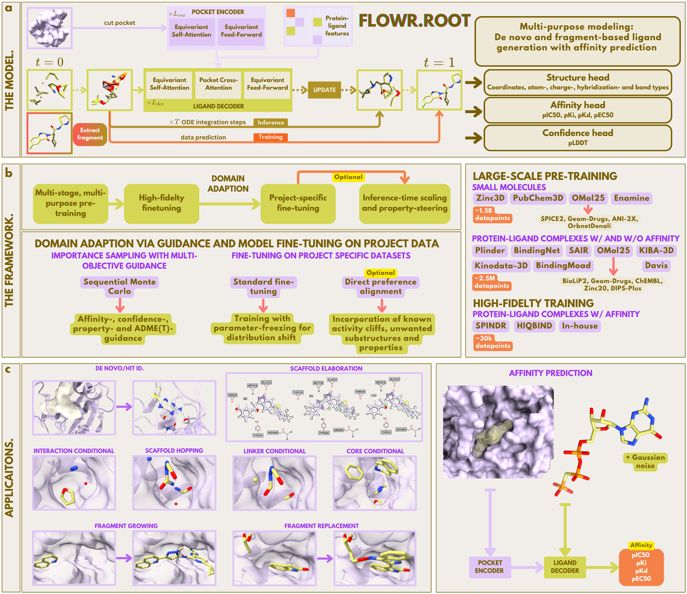
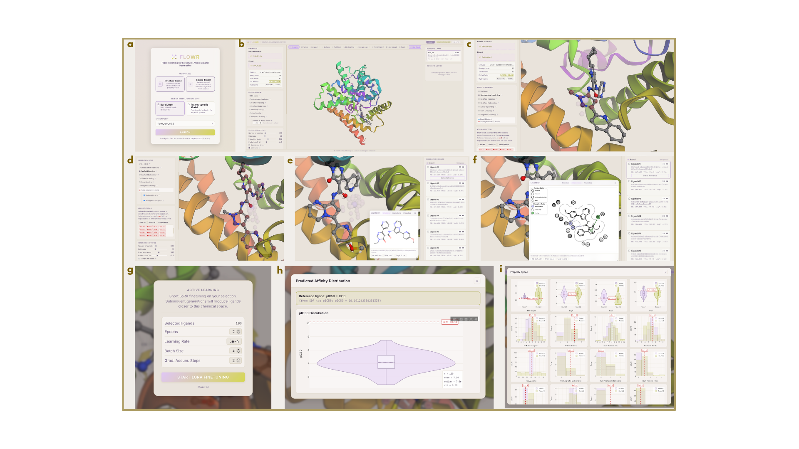

# Flowr.root -- A flow matching based foundation model for joint multi-purpose structure-aware 3D ligand generation and affinity prediction

[](https://arxiv.org/abs/2510.02578)



This is a research repository introducing FLOWR.root.

**⚠️ PLEASE NOTE:** Due to computational constraints, the joint affinity and ligand generation model is not fully converged. As shown in the paper, it nevertheless reaches state-of-the-art performance across benchmarks, but we'd expect substantially better results with extended training (we found, e.g., that clash count can be a problem on OOD data, while less so in the fully converged structure-only model - a fully converged, generation-only model trained on SPINDR is also provided; see [Checkpoints](#checkpoints)). Also note, the affinity head is accurate in-distribution; on out-of-distribution data, e.g. OOD in-series compounds, it should be combined with LoRA adaptation (as described in the paper and fully supported by the code in this repo). The FLOWR.ui provides almost all functionalities of the model accessible via browser - use Claude/Codex to set it up for you in a few minutes, no code needed.

---

## Table of Contents

- [Installation](#installation)
- [FLOWR.ui](#flowrui)
- [Tutorial](#tutorial)
- [Getting Started](#getting-started)
  - [Checkpoints](#checkpoints)
  - [Data](#data)
  - [Generating Molecules from PDB/CIF](#generating-molecules-from-pdbcif)
  - [Generating Molecules from SDF (Ligand-only)](#generating-molecules-from-sdf-ligand-only)
  - [Predicting Binding Affinities](#predicting-binding-affinities)
  - [Training](#training)
- [Data Preprocessing](#data-preprocessing)
  - [Input Data Requirements](#-input-data-requirements)
  - [Preprocessing Workflow](#-preprocessing-workflow)
- [Finetuning](#finetuning)
  - [Prerequisites](#prerequisites)
  - [Running Full Fine-tuning](#running-full-fine-tuning)
  - [Running LoRA Fine-tuning](#running-lora-fine-tuning)
- [Contributing](#contributing)
- [License](#license)
- [Citation](#citation)

---

## Installation

- **GPU**: CUDA-compatible GPU with at least 40GB VRAM recommended for inference

- **Installation time**: Installation takes roughly 5 minutes on a normal computer.

- **Package Manager**: [uv](https://docs.astral.sh/uv/)
  Install via:

  ```bash
  curl -LsSf https://astral.sh/uv/install.sh | sh
  ```

1. **Create the Environment**

   On Linux with a CUDA GPU:

   ```bash
   uv sync --extra gpu
   ```

   On macOS (tested on Apple M3 Max) or any CPU-only machine:

   ```bash
   uv sync --extra cpu
   ```

   The `cpu` and `gpu` extras are mutually exclusive — they select the PyTorch wheel
   flavour. `uv sync` creates `.venv/` in the repository root, installs the exact
   versions recorded in the committed `uv.lock`, and installs FLOWR.root itself into
   the environment.

   To also install FLOWR.ui, the notebook tutorial, the extended evaluation
   metrics, or the PLINDER dataset utilities, add the corresponding extras:

   ```bash
   uv sync --extra gpu --extra vis          # + FLOWR.ui web app
   uv sync --extra cpu --extra notebooks    # + examples/examples.ipynb
   uv sync --extra gpu --extra eval         # + FCD and extended metrics
   uv sync --extra gpu --extra plinder      # + PLINDER dataset tooling
   ```

2. **Run commands**

   Prefix any command with `uv run --no-sync`:

   ```bash
   uv run --no-sync python -m flowr.gen.generate_from_pdb --help
   ```

   or activate the environment once and drop the prefix:

   ```bash
   source .venv/bin/activate
   ```

   `--no-sync` runs the command against the `.venv` exactly as `uv sync` built it.
   Without the flag, uv re-resolves the project to its default, no-extra dependency
   set on every invocation, which replaces your CUDA `torch` build with the plain
   PyPI wheel. After changing extras, re-run `uv sync` rather than dropping the flag.

   **No `PYTHONPATH` setup is required.** FLOWR.root is installed into the
   environment as a package, so `python -m flowr.<module>` works from anywhere.

3. **Device selection**

   Generation and prediction entrypoints pick the device themselves: CUDA when the
   machine has it, CPU otherwise. `--gpus` is a device *count*, so `--gpus 0` pins a run
   to CPU even on a CUDA box. No flag or code change is needed to run the CPU/macOS
   install above - just expect CPU inference to take minutes rather than seconds.

   Apple's MPS backend is **not** selected automatically. It is considerably faster than
   CPU on the default `semla` backbone, but it is not a supported configuration - the
   `e3nn` backbone needs float64, which MPS cannot represent - so it is opt-in and
   unvalidated:

   ```bash
   FLOWR_DEVICE=mps uv run --no-sync python -m flowr.predict.predict_from_pdb ...
   ```

   Note that results are not reproducible across devices: a fixed `--seed` gives
   different samples on CPU, MPS and CUDA, because each backend has its own RNG stream.

<details>
<summary><b>Optional external toolkits</b></summary>

A few capabilities depend on toolkits that are not installable from PyPI. FLOWR.root
runs without them — only the specific feature is unavailable.

| Toolkit | Needed for | Notes |
| --- | --- | --- |
| **OpenEye** | shape-based alignment and conformer utilities (`flowr/util/sampling/openeye.py`, `flowr_vis/oe_conformer.py`) | Commercial licence. Install the `OpenEye-toolkits` wheel from OpenEye's own package index and point `OE_LICENSE` at your licence file. |
| **PyMOL** | the PyMOL PDB-writing paths in `flowr/util/pocket.py` and `flowr/gen/utils.py` | There is no `pymol` extra: the only PyPI distribution is a broken `pymol-open-source` 3.2.0a0 pre-release, so install PyMOL from your system package manager or an upstream installer if you need these paths. Without it there is no automatic fallback — `PocketComplex.write_complex_pdb()` raises `ImportError` unless its caller passes `obabel=True` to select the Open Babel branch, and `write_ligand_pocket_complex_pdb()` has no Open Babel branch at all. |
| **`reduce`** | protonation for the PoseCheck interaction metrics | Build from [rlabduke/reduce](https://github.com/rlabduke/reduce) and put it on `PATH`. |

</details>

---

## FLOWR.ui


FLOWR.root ships with **FLOWR.ui**, an interactive web application for structure-based and ligand-based generation directly from your browser. Upload a protein structure, visualize the binding site in 3D, select atoms for conditional generation, and inspect results — all without writing a single command.

The app lives in the `flowr_vis/` directory and uses a two-tier architecture: a CPU-based frontend server (`server.py`) that serves the web UI and handles molecule parsing, and a GPU worker (`worker.py`) that runs the model. On HPC clusters, the frontend auto-submits a SLURM GPU job on demand. Can also be run locally on a Mac with MPS.

See [`flowr_vis/README.md`](flowr_vis/README.md) for setup and usage instructions.

---

## Tutorial

A Jupyter Notebook tutorial is provided at examples/examples.ipynb alongside a few protein-ligand complexes to play around with!
You can also run this on your MacBook - run `uv sync --extra cpu --extra notebooks` and you are good to go (see [Installation](#installation)).

---

## Getting Started

We provide all datasets in PDB and SDF format, as well as trained FLOWR.root checkpoints.
For training and generation, we provide basic bash and SLURM scripts in the `scripts/` directory. These scripts are intended to be modified and adjusted according to your computational resources and experimental needs.

### Checkpoints

All checkpoints can be downloaded from [Google Drive](https://drive.google.com/drive/u/0/folders/1NWpzTY-BG_9C4zXZndWlKwdu7UJNCYj8):

- `flowr_root_v2.2.ckpt` — latest joint ligand generation and affinity model.
- `flowr_root_v2.ckpt` — original model behind most results in the paper; use it for reproduction.
- `flowr_root_spindr_base.ckpt` — fully converged, generation-only model trained on SPINDR (shows slightly more creative ligand generation, less clashes OOD, best as ideation tool).
- `flowr_root_v2_mol.ckpt` — ligand-only generation without protein context (see [Generating Molecules from SDF](#generating-molecules-from-sdf-ligand-only)).

### Data

All datasets can be downloaded from [Google Drive](https://drive.google.com/drive/u/0/folders/1NWpzTY-BG_9C4zXZndWlKwdu7UJNCYj8).

### Generating Molecules from PDB/CIF

If you provide a protein PDB/CIF file, you need to provide a ligand file (SDF/MOL/PDB) as well to cut out the pocket. The `--pocket_cutoff` default is 6 Å; the shipped
`scripts/generate_pdb.sl` passes `--pocket_cutoff 7` - modify either if needed.
We recommend using (Schrödinger-)prepared complexes for best results with the protein and ligand being protonated.

Note, if you want to run conditional generation, you need to provide a ligand file as reference.
Crucially, there are two different modes, "global" and "local".
Global: If you want to run scaffold hopping or elaboration (scaffold_hopping, scaffold_elaboration), interaction- (interaction_conditional), core-conditional (core_growing) or general fragment-conditional (fragment_growing) generation, simply specifiy it via the respective flags (more below).
Local: If you want to replace a core, or a fragment/any part of your reference ligand, specify the --substructure_inpainting flag and provide the atom indices with the --substructure flag that you want to change. This will trigger a local replacement via automated prior-shifting.
In both cases, the generation is not fully deterministic and fixed parts might also be slightly changed by the model. This can be seen as a feature (shape-based exploration), or as a bug. If you are team bug, set the --filter_cond_substructure flag (RDKit will try to filter based on substructure matching).

Modify `scripts/generate_pdb.sl` according to your requirements, then submit the job via SLURM:

```bash
sbatch scripts/generate_pdb.sl
```

**Conditional Generation Options:**

**⚠️ NOTE:** Inpainting modes slightly changed with push from 02.06.2026; see below:

- `--substructure_inpainting`: Enable substructure generation (e.g. fragment replacement)
- `--substructure`: Atom indices that you want to change (!) (e.g., `21 23 30 31 32 33 34 35`)
- `--fragment_growing`: Fragment-constrained generation (using provided fragment to grow from)
- `--grow_size`: Number of atoms to grow additional to given fragment (only for fragment_growing mode)
- `--prior_center_file`: Provide starting coordinate(s)/density as xyz file (can be std. xyz-file, only x y z, or numpy array-like 2d matrix; only for fragment_growing mode)
- `--core_growing`: Core-constrained generation (using RDKit to extract a core; if multiple cores, select by index using `--ring_system_index`, which defaults to 0)
- `--ring_system_index`: Use when running core_growing to select the core (default: 0; only relevant if number of cores > 1)
- `--scaffold_hopping`: Scaffold generation (using RDKit to extract functional groups)
- `--scaffold_elaboration`: Functional group generation (using RDKit to extract scaffold)
- `--interaction_conditional`: Interaction-constrained generation mode (using ProLIF to extract interactions)
- `--compute_interactions`: Needed for interaction_conditional (using ProLIF to extract interactions)
- `--filter_cond_substructure`: Filter to ensure inpainting constraint is satisfied

**⚠️ Diversity filtering starves inpainting runs:** diversity filtering is a poor fit for the modes above: constrained outputs are similar by construction - every molecule keeps the same fixed core - so nearly all pairs exceed the Tanimoto threshold and get discarded. Measured on 1iep with the `--diversity_threshold 0.7` that `scripts/generate_pdb.sl` used to ship, substructure inpainting produced 20 valid, fully substructure-matching molecules per iteration yet finished with 2 ligands after 11 iterations (411 s), versus 8-20 molecules in a third of the time without the filter. That script now ships `--diversity_threshold 0.95`, which only drops near-duplicates and is safe for the de-novo run it performs by default. **When you enable any inpainting mode, delete the `--filter_diversity` and `--diversity_threshold` lines from the command entirely.**

**Prior Options:**

- `--anisotropic_prior`: Use an anisotropic (pocket-shape-adapted) prior distribution instead of the default isotropic Gaussian. This better captures the binding site geometry and can improve pose quality.
- `--ref_ligand_com_prior`: Center the prior distribution on the reference ligand's center of mass. Focuses generation around the known binding pose.
- `--ref_ligand_com_noise_std`: Standard deviation of noise added to the reference ligand center of mass (default: 0.05). The default already adds slight spatial variation while keeping the prior anchored; raise it to explore more, or set it to `0.0` to pin the prior exactly on the reference center of mass.

**Post-processing Options:**

- `--filter_valid_unique`: Filter for valid and unique molecules
- `--filter_diversity`: Apply diversity filtering
- `--diversity_threshold`: Tanimoto similarity threshold for diversity (CLI default: 0.9; `scripts/generate_pdb.sl` sets 0.95 - see the warning above before using either with an inpainting mode)
- `--optimize_gen_ligs`: Optimize geometries in-pocket (using RDKit)
- `--optimize_gen_ligs_hs`: Optimize ligand hydrogens in-pocket (using RDKit)
- `--filter_cond_substructure`: Filter to ensure inpainting constraint is satisfied
- `--filter_pb_valid`: Filter by PoseBusters validity for generated molecules (using PoseBusters)
- `--calculate_pb_valid`: Calculate PoseBusters validity for generated molecules (using PoseBusters)
- `--calculate_strain_energies`: Calculate strain energies for generated molecules (using RDKit)
- `--compute_interaction_recovery`: Calculate interaction recovery (using ProLIF)

- **Output**: Generated ligands are saved as an SDF file at the specified location (save_dir) alongside the extracted pockets. The SDF file also contains predicted affinity values (pIC50, pKi, pKd, pEC50)
- **Runtime**: Depends on system size, hardware specs. and batch size, but roughly 15s for 100 ligands on an H100 GPU.

### Predicting Binding Affinities

Provide a protein PDB/CIF and a ligand file (SDF/MOL/PDB)
Modify `scripts/predict_aff.sl` according to your requirements, then submit the job via SLURM:

```bash
sbatch scripts/predict_aff.sl
```

For scoring **many ligands against one protein** in a single job, use
`scripts/predict_aff_multi.sl` instead. It is the same pipeline with `--multiple_ligands`
added, reading all ligands from one SDF and averaging over several seeds:

```bash
sbatch scripts/predict_aff_multi.sl
```

- **Output**: The scored ligands are saved as an SDF file at the specified location (save_dir).
These are the input structures you supplied - affinity prediction scores the ligand it is
given, it does not generate one - annotated with the predicted affinity values (pIC50, pKi, pKd, pEC50)

### Generating Molecules from SDF (Ligand-only)

For ligand-only generation without a protein context, you can use the SDF-based generation script. All inpainting modes can be used here as well.
Note, use the flowr_root_v2_mol.ckpt for that!

Modify `scripts/generate_sdf.sl` according to your requirements:

**Conditional Generation Options:**

- `--substructure_inpainting`: Enable substructure generation
- `--substructure`: Atom indices that you want to change (!) (e.g., `21 23 30 31 32 33 34 35`)
- `--scaffold_hopping`: Scaffold generation (using RDKit to extract RDKit)
- `--scaffold_elaboration`: Functional group generation (using RDKit to extract all functional groups)

**Post-processing Options:**

- `--filter_valid_unique`: Filter for valid and unique molecules
- `--filter_diversity`: Apply diversity filtering
- `--diversity_threshold`: Tanimoto similarity threshold for diversity (default: 0.9)
- `--add_hs_gen_mols`: Add hydrogens to generated molecules (using RDKit)
- `--optimize_gen_mols_rdkit`: Optimize geometries (using RDKit)
- `--optimize_gen_mols_xtb`: Optimize geometries (using xTB)
- `--calculate_strain_energies`: Calculate strain energies for generated molecules (using RDKit)
- `--filter_cond_substructure`: Filter to ensure inpainting constraint is satisfied

Submit the job via SLURM:

```bash
sbatch scripts/generate_sdf.sl
```

- **Output**: Generated ligands are saved as an SDF file at the specified location (save_dir).

- **Runtime**: Depends on the number of molecules, hardware specs, and batch size.

### Training

To train FLOWR.root on preprocessed datasets downloaded from [Google Drive](https://drive.google.com/drive/u/0/folders/1NWpzTY-BG_9C4zXZndWlKwdu7UJNCYj8), modify `scripts/train.sh` to your needs and run

```bash
bash scripts/train.sh
```

- **Output**: Checkpoints will be saved at the specified location (save_dir).

#### Warm-starting from a released checkpoint

`--load_pretrained_ckpt <ckpt>` starts training from released weights instead of from
scratch. The architecture flags on the command line must match the architecture that was
trained, because they are what builds the model the weights are loaded into - nothing is
read back from the checkpoint. **The flags in `scripts/train.sh` as shipped do not match
`flowr_root_v2.2.ckpt`**; they match `flowr_root_spindr.ckpt`.

A mismatch fails loudly, before any training happens, with a message naming the tensor:

```text
size mismatch for ligand_dec.inv_emb.atom_emb.0.weight: copying a param with
shape torch.Size([512, 271]) from checkpoint, the shape in current model is
torch.Size([384, 271]).
```

The flags that differ between the released checkpoints (values read from each
checkpoint's `hyper_parameters` and confirmed against its tensor shapes):

| Flag | `flowr_root_v2.2` / `v2.1` | `flowr_root_spindr` / `v2_mol` |
| --- | --- | --- |
| `--d_model` | **512** | 384 |
| `--use_crossproducts` | **omit** | pass it |
| `--predict_affinity` | pass it | omit |

Note that `--use_crossproducts` and `--predict_affinity` are anti-correlated across the
released models: the joint affinity models (`v2.2`, `v2.1`) have no cross-products, and
the generation-only models (`spindr`, `v2_mol`) have cross-products and no affinity head.

So to warm-start from `flowr_root_v2.2.ckpt`, take `scripts/train.sh` and change
`--d_model 384` to `--d_model 512`, delete the `--use_crossproducts` line, keep
`--predict_affinity`, and add `--load_pretrained_ckpt /path/to/flowr_root_v2.2.ckpt`.
Every other architecture flag `scripts/train.sh` passes is already correct for v2.2. The
full set that must be in effect:

```text
--arch pocket  --pocket_noise fix
--d_model 512  --n_coord_sets 128  --d_edge 128  --emb_size 64  --n_layers 12
--d_message 64  --d_message_hidden 96  --n_attn_heads 32
--pocket_d_model 256  --pocket_n_layers 4
--use_distances  --use_rbf  --use_lig_pocket_rbf  --use_fourier_time_embed
--self_condition  --remove_hs  --remove_aromaticity  --predict_affinity
```

`--pocket_n_layers 4` and `--d_model 512` both differ from the argparse defaults (6 and
384), so they have to be passed explicitly. `--use_sphcs`, `--add_feats` and
`--predict_docking_score` must stay off - none of the released checkpoints use them.
For `flowr_root_v2_mol.ckpt` (ligand-only, trained with `flowr/train_mol.py`) use
`--d_model 384 --use_crossproducts` and no `--use_lig_pocket_rbf`.

To *resume* an interrupted run of your own rather than warm-start a new one, use
`--load_ckpt`, which restores optimizer and scheduler state as well.

---

## Data Preprocessing

To train/finetune FLOWR.root on your own custom datasets, you'll need to preprocess your protein-ligand complexes into the required LMDB format. The `flowr/data/preprocess_data/` directory contains all necessary SLURM batch scripts to streamline this workflow.

### 📁 Input Data Requirements

Your input data should be organized in a folder named `data/` with the following structure:

- **Ligand files**: SDF format
- **Protein files**: PDB format
- **Naming convention**: Files must share a consistent system identifier, like

```text
data/
├── system_1.sdf
├── system_1.pdb
├── system_2.sdf
├── system_2.pdb
└── ...
```

#### Binding affinity labels (optional)

Affinity labels are **optional**. If you supply none, preprocessing still succeeds and every
affinity field is stored as `NaN` — that is the normal case for structures you have no
measurements for. Only add `--predict_affinity` to your training/fine-tuning command if a
meaningful fraction of your systems is labelled.

There are two ways to attach labels, and they are mutually exclusive:

1. **SD properties on the ligand** (default, no extra flag). Set a property named `pIC50`,
   `pKi`, `pKd` or `pEC50` on the molecule in the SDF. Matching is case-insensitive, and the
   values are expected on the p-scale (`p = -log10(value in molar)`), so `IC50 = 150 nM`
   becomes `pIC50 = 6.824`.

2. **A metadata CSV**, passed as `--metadata_file`. The CSV is looked up by system identifier
   and may carry raw values with units (e.g. `IC50_value` / `IC50_unit`), which are converted
   to the p-scale for you.

Systems may be labelled with different assay types, and a mix of labelled and unlabelled
systems in one dataset is supported.

---

### 🔄 Preprocessing Workflow

The preprocessing pipeline consists of three sequential steps:

#### **Step 1: Create LMDB Chunks** (`preprocess.sl`)

This script parallelizes the preprocessing across multiple jobs, creating N LMDB databases.

1. Modify `flowr/data/preprocess_data/custom_data/preprocess.sl` according to:
   - Your compute environment (partition, memory, time limits)
   - Your folder structure (paths to `data/` directory)
   - Number of parallel jobs via `num_jobs` parameter (e.g., `num_jobs=100` for larger, `num_jobs=10` for smaller datasets)
   - SLURM array size, which **must equal** `num_jobs` (`--array=1-N` with `N == num_jobs`)

   > The dataset is split into exactly `num_jobs` chunks, one per array task. A smaller
   > array leaves the trailing chunks unprocessed with no warning, so those systems never
   > make it into the LMDB. `num_jobs` larger than your number of systems is fine: the
   > surplus tasks are assigned an empty chunk and exit immediately.

2. Submit the job:

   ```bash
   sbatch flowr/data/preprocess_data/custom_data/preprocess.sl
   ```


#### **Step 2: Merge LMDB Databases** (`merge.sl`)

Once all preprocessing jobs complete, merge the individual LMDB chunks into a single database.

1. Modify `flowr/data/preprocess_data/custom_data/merge.sl` if needed

2. Submit the merge job:

   ```bash
   sbatch flowr/data/preprocess_data/custom_data/merge.sl
   ```

3. Output: Unified LMDB saved in final/ folder

#### **Step 3: Calculate Data Statistics** (data_statistics.sl)

This final step computes essential data distribution statistics required for training.

1. Modify `flowr/data/preprocess_data/custom_data/data_statistics.sl` according to your split preference:

2. Submit the statistics job:

   ```bash
   sbatch flowr/data/preprocess_data/custom_data/data_statistics.sl
   ```

**Option A: Custom Train/Val/Test Split**

- Place your `splits.npz` file (with keys idx_train, idx_val and idx_test containing indices) in the `final/` folder
- Comment out **both** `--val_size` and `--test_size` in `data_statistics.sl`. They are the
  last two arguments of the command precisely so that this is safe: a commented-out line
  ends a backslash-continued command, so anything you leave below it is silently dropped
  and then run as a stray command (`--seed: command not found`). Comment the pair out
  together, and never leave a live argument underneath them.

**Option B: Random Split**

- The script will automatically create train/val/test splits with the specified sizes
- Modify `--val_size` and `--test_size` as needed. A value **below 1 is a fraction** of the
  dataset (the shipped default is `0.1`, i.e. 10% each for val and test); a **whole number
  >= 1 is an absolute count** of systems. Training gets whatever is left over.
- Use fractions on small datasets. Absolute sizes that exceed the dataset abort the run
  with `AssertionError: One of training (-98), validation (10) or testing (100) splits
  ended up with a negative size.`
- Adjust `--seed` for reproducibility

1. Output: Statistics saved alongside the final LMDB database

---

## Finetuning

FLOWR.root can be fine-tuned on your custom datasets using full model or LoRA fine-tuning.

### Prerequisites

Before fine-tuning, ensure you have:

1. Preprocessed your custom dataset following the [Data Preprocessing](#data-preprocessing) workflow
2. Downloaded the pre-trained FLOWR.root checkpoint from [Google Drive](https://drive.google.com/drive/u/0/folders/1NWpzTY-BG_9C4zXZndWlKwdu7UJNCYj8)

### Running Full Fine-tuning

1. Modify `scripts/finetune.sl` according to your setup

2. Submit the full fine-tuning job:

   ```bash
   sbatch scripts/finetune.sl
   ```


### Running LoRA Fine-tuning

1. Modify `scripts/finetune_lora.sl` according to your setup.

2. Submit the LoRA fine-tuning job:

   ```bash
   sbatch scripts/finetune_lora.sl
   ```

### Tuning EMA for small datasets

Both fine-tuning scripts train with an exponential moving average of the weights
(`--use_ema`, `--ema_decay 0.998`) and **validate the EMA weights, not the live ones**.
The EMA has a horizon of roughly `1 / (1 - ema_decay)` optimizer steps — about 500 steps
at the default `0.998`.

On a small custom dataset that is a lot of epochs. With, say, 8 training systems and 2
optimizer steps per epoch, a few hundred steps of fine-tuning leaves the EMA weights
still essentially the pretrained ones, so validation metrics and the `save_top_k`
selection reflect the base model rather than your fine-tune.

Rules of thumb:

- Aim for `ema_decay` such that `1 / (1 - ema_decay)` is well under your total step count.
  For a few hundred total steps, `--ema_decay 0.99` (~100 steps) or `0.95` (~20 steps) is
  far more informative than the default.
- Or switch it off entirely with `--no-use_ema`, which validates and checkpoints the live
  weights. (`--use_ema` is on by default; `--no-use_ema` is the way to disable it.)

Two more things bite on small datasets and short runs:

- **Checkpoint selection is close to random when the validation split is tiny.** The
  `ModelCheckpoint` monitors `val-pb-validity` with `mode="max"`, and with a
  single-system validation split that metric is effectively a coin flip - three
  identical 6-epoch runs measured `0.0/0.0/1.0`, `0.0/1.0/0.0` and `0.0/1.0/1.0` - so
  `save_top_k` keeps an arbitrary epoch rather than the best one. This compounds the EMA
  caveat above: the metric that picks the checkpoint is noise, and (at the default
  `ema_decay`) it is measured on weights that have barely moved. Prefer `last.ckpt`, or
  hold out enough validation systems for the metric to mean something.
- **Runs shorter than 50 optimizer steps log no training metrics at all.**
  `log_every_n_steps` is never set, so Lightning's default of 50 applies and a run with
  fewer optimizer steps than that flushes no `train-*` metrics to MLflow - the losses
  exist only in the tqdm stream. Logging is not broken; there was simply never a flush.
  There is no CLI flag for this - judge short smoke runs from the console output, or run
  past 50 steps if you need the logged curves.

---

## Contributing

Contributions are welcome! If you have ideas, bug fixes, or improvements, please open an issue or submit a pull request.

To run the test suite, install the `dev` extra and invoke pytest:

```bash
uv sync --extra cpu --extra dev
uv run --no-sync pytest
```

---

## License

This project is licensed under the [MIT License](LICENSE), with one exception: the
FLOWR.ui visualization app in `flowr_vis/` is distributed under its own
source-available license (see [`flowr_vis/LICENSE`](flowr_vis/LICENSE)).

---

## Citation

If you use FLOWR.root in your research, please cite it as follows:

```bibtex
@misc{cremer2025flowrrootflowmatchingbased,
      title={FLOWR.root: A flow matching based foundation model for joint multi-purpose structure-aware 3D ligand generation and affinity prediction},
      author={Julian Cremer and Tuan Le and Mohammad M. Ghahremanpour and Emilia Sługocka and Filipe Menezes and Djork-Arné Clevert},
      year={2025},
      eprint={2510.02578},
      archivePrefix={arXiv},
      primaryClass={q-bio.BM},
      url={https://arxiv.org/abs/2510.02578},
}
```

---
