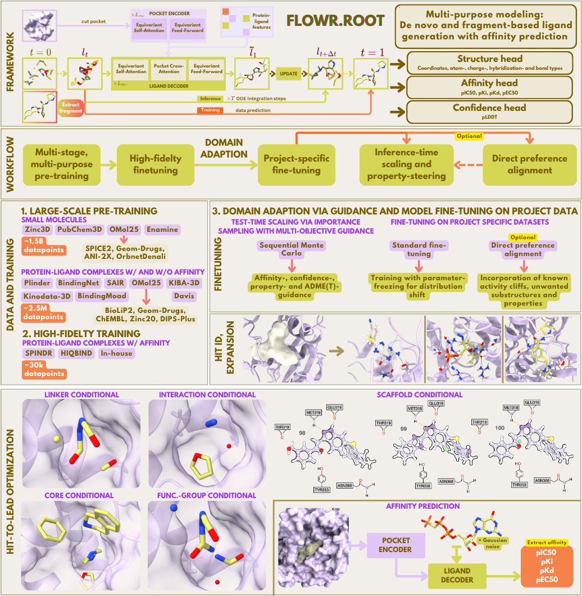

# Flowr.root -- A flow matching based foundation model for joint multi-purpose structure-aware 3D ligand generation and affinity prediction


This is a research repository introducing FLOWR.root. 

**⚠️ PLEASE NOTE:** This is an early release. Currently, only ligand generation and affinity prediction scripts are provided alongside the model weights. Full training details, additional generation modes, and (LoRA-)finetuning documentation will be added progressively over time.

---

## Table of Contents

- [Installation](#installation)
- [Getting Started](#getting-started)
  - [Data](#data)
  - [Generating Molecules from PDB/CIF](#generating-molecules-from-pdb)
  - [Affinity prediction](#affinity-prediction)
- [Contributing](#contributing)
- [License](#license)
- [Citation](#citation)

---


## Installation

- **GPU**: CUDA-compatible GPU with at least 40GB VRAM recommended for generation

- **Package Manager**: [mamba](https://mamba.readthedocs.io)  
  Install via:
  ```bash
  curl -L -O https://github.com/conda-forge/miniforge/releases/latest/download/Miniforge3-$(uname)-$(uname -m).sh
  bash Miniforge3-$(uname)-$(uname -m).sh
  ```

1. **Create the Environment**  
   Install the required environment using [mamba](https://mamba.readthedocs.io):

   ```bash
   mamba env create -f environment.yml
   ```

2. **Activate the Environment**  

   ```bash
   conda activate flowr_root
   ```

3. **Set PYTHONPATH**  
   Ensure the repository directory is in your Python path:

   ```bash
   export PYTHONPATH="$PWD"
   ```

---

## Getting Started

We provide all datasets in PDB and SDF format, as well as a fully trained FLOWR.root model checkpoint.
For training and generation, we provide basic bash and SLURM scripts in the `scripts/` directory. These scripts are intended to be modified and adjusted according to your computational resources and experimental needs.

### Data
Download the datasets and the FLOWR.root checkpoint here:
[Google Drive](https://drive.google.com/drive/u/0/folders/1NWpzTY-BG_9C4zXZndWlKwdu7UJNCYj8).


### Generating Molecules from PDB/CIF

If you provide a protein PDB/CIF file, you need to provide a ligand file (SDF/MOL/PDB) as well to cut out the pocket (default: 7A cutoff - modify if needed).
We recommend using (Schrödinger-)prepared complexes for best results with the protein and ligand being protonated.

Note, if you want to run conditional generation, you need to provide a ligand file as reference. 

Modify `scripts/generate_pdb.sl` according to your requirements, then submit the job via SLURM:

```bash
sbatch scripts/generate_pdb.sl
```

Generated ligands are saved as an SDF file at the specified location (save_dir) alongside the extracted pockets. 
The SDF file also contains predicted affinity values (pIC50, pKi, pKd, pEC50)


### Predicting Binding Affinities

Provide a protein PDB/CIF and a ligand file (SDF/MOL/PDB)
Modify `scripts/predict_aff.sl` according to your requirements, then submit the job via SLURM:

```bash
sbatch scripts/predict_aff.sl
```

De-noised ligands are saved as an SDF file at the specified location (save_dir). 
The SDF file contains predicted affinity values (pIC50, pKi, pKd, pEC50)

---

## Contributing

Contributions are welcome! If you have ideas, bug fixes, or improvements, please open an issue or submit a pull request.

---

## License

This project is licensed under the [MIT License](LICENSE).

---

## Citation

If you use FLOWR.root in your research, please cite it as follows:

```bibtex
@misc{cremer2025flowrrootflowmatchingbased,
      title={FLOWR.root: A flow matching based foundation model for joint multi-purpose structure-aware 3D ligand generation and affinity prediction}, 
      author={Julian Cremer and Tuan Le and Mohammad M. Ghahremanpour and Emilia Sługocka and Filipe Menezes and Djork-Arné Clevert},
      year={2025},
      eprint={2510.02578},
      archivePrefix={arXiv},
      primaryClass={q-bio.BM},
      url={https://arxiv.org/abs/2510.02578}, 
}
```

---